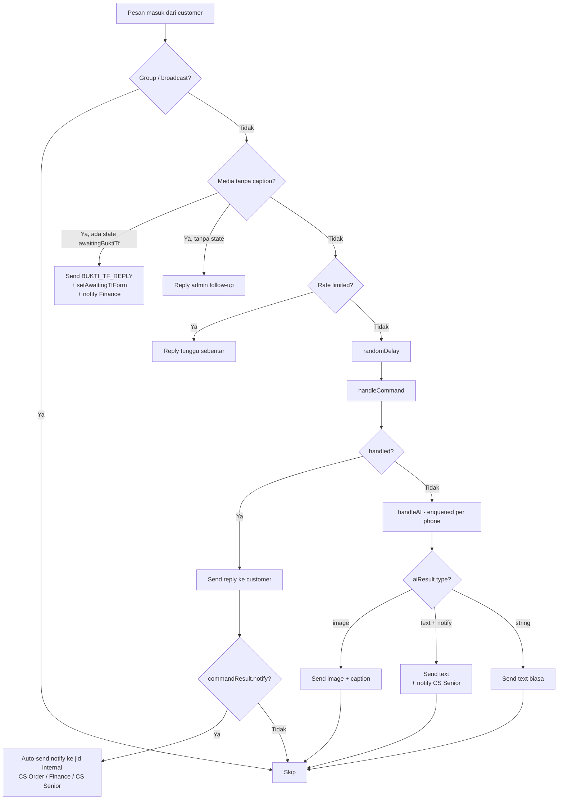
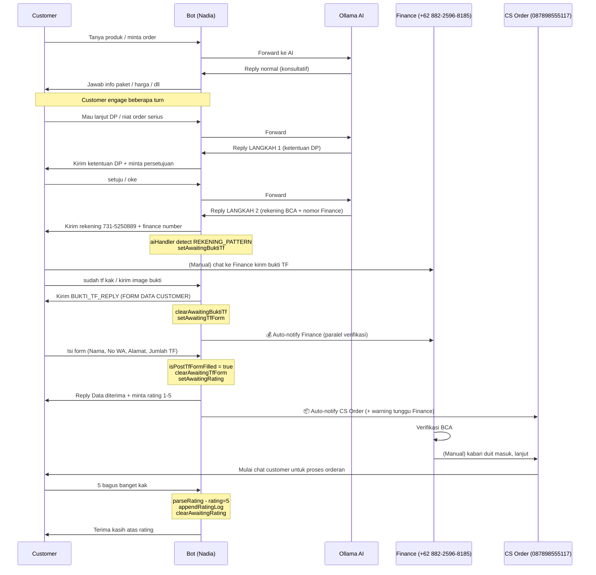
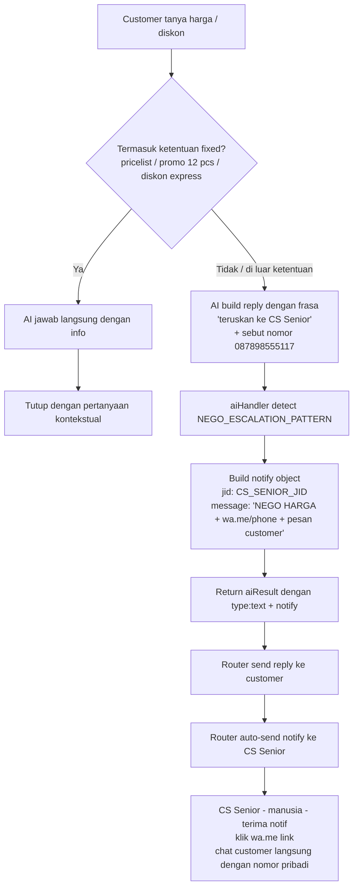
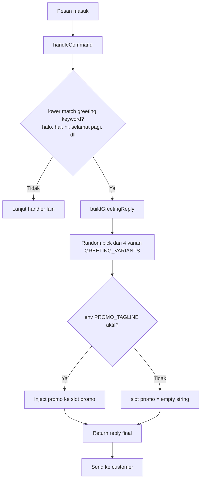
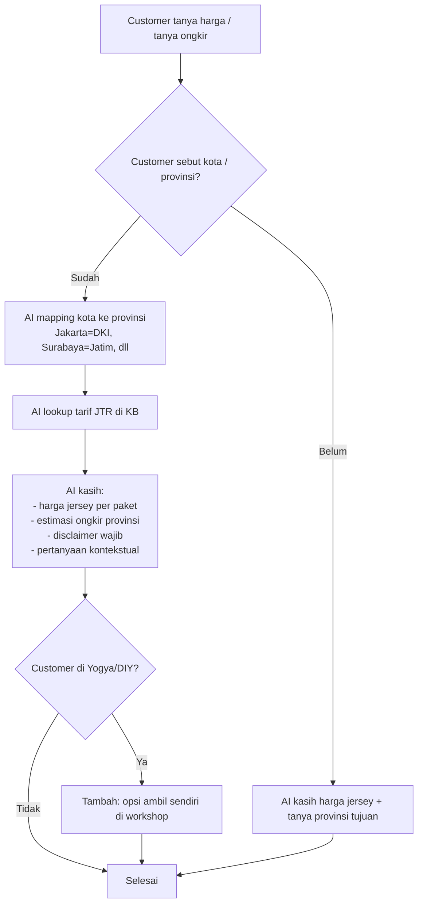
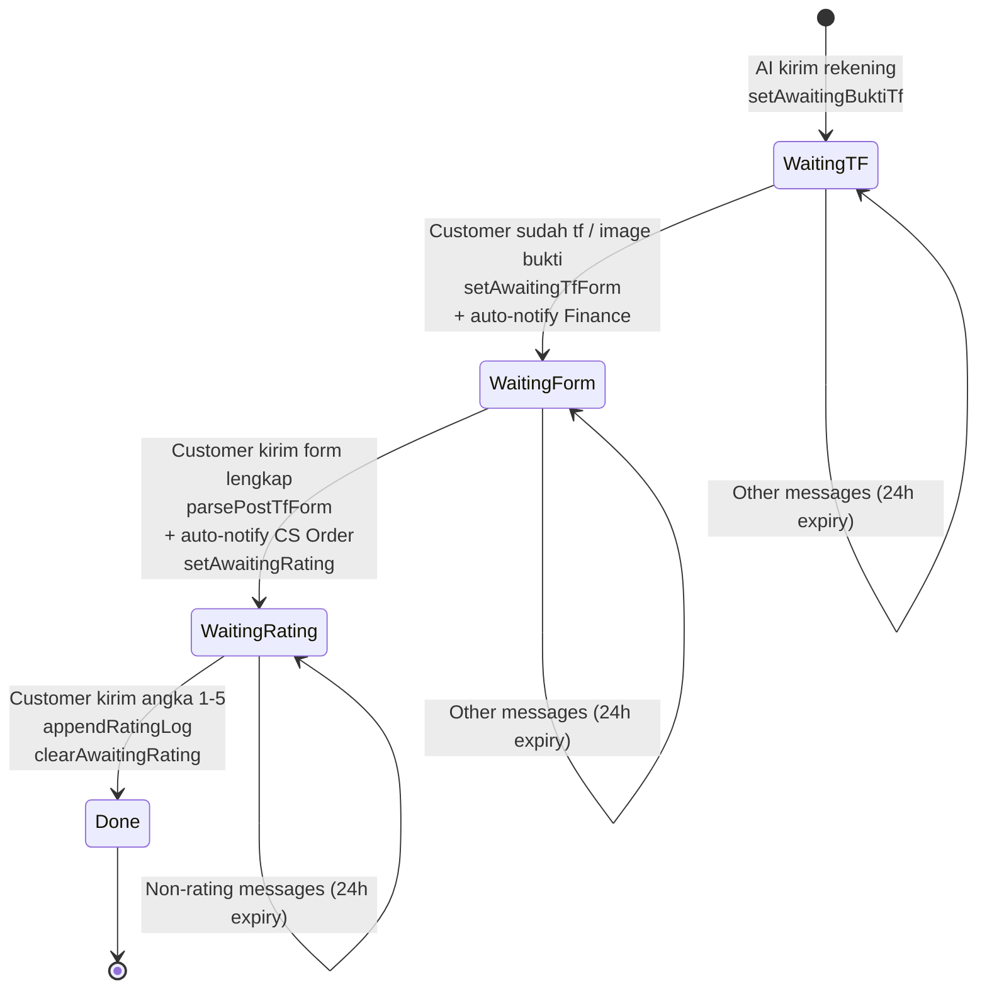

# Laporan Revisi Chatbot Ayres Apparel

**Tanggal:** 26 Mei 2026
**Branch:** `main`
**Commits:** `aa89652`, `4b0ddca`, `77333f4`, `fd2b3de`, `4c42567`, `95cc0bb`, `9565536`, `77ca754`, `230de4b`, `738b590`, `8cdfe93`, (+ commit update laporan terbaru)
**Status:** Sudah di-push ke `origin/main`, Railway auto-deploy aktif
**Author:** Ezra Kristanto Nahumury (dibantu Claude Code)

---

## 1. Ringkasan Eksekutif

Sesi revisi hari ini menyelesaikan **16 item perubahan** terhadap chatbot WhatsApp Ayres Apparel. Cakupan revisi mencakup empat bidang utama:

1. **Persona & komunikasi** — penyegaran greeting, aturan penutup chat, anti-template, dan penghapusan dump form 9-poin.
2. **Data referensi & sales aid** — tabel tarif ongkir per provinsi (JNE JTR), penyempurnaan skema paket express + diskon volume, rule urgency closing, dan dokumentasi Deadline Lock + program kompensasi keterlambatan.
3. **Eskalasi & multi-channel handover** — handling nego harga di luar ketentuan, handling permintaan promo yang belum ada, dan eskalasi otomatis ke CS Senior.
4. **Flow post-pembayaran** — form data customer setelah bukti TF, paralel notify ke Finance, forward otomatis ke CS Order, dan capture rating chatbot.

Total file yang dimodifikasi: **5 file inti** (`src/ai/prompt.js`, `src/handlers/commandHandler.js`, `src/handlers/aiHandler.js`, `src/core/router.js`, `knowledge-base.json`) + **2 file dokumentasi & aset baru** (`REVISI_CHATBOT_MEETING_2026-05-25.md`, `gambar/express/`).

---

## 2. Tabel Ringkasan 16 Revisi

| # | Item | File Diubah | Status |
|---|------|-------------|--------|
| 1 | Greeting tanpa "AI asisten" + 4 varian random + slot promo | `commandHandler.js`, `prompt.js` | ✅ Selesai |
| 2 | Wajib akhiri chat dengan pertanyaan kontekstual | `prompt.js` | ✅ Selesai |
| 3 | Hapus form 9-poin saat order intent | `commandHandler.js`, `prompt.js` | ✅ Selesai |
| 4 | Ongkir JNE JTR per provinsi + disclaimer wajib | `knowledge-base.json`, `prompt.js` | ✅ Selesai |
| 5 | Express service 5 tier + diskon volume + ketentuan | `knowledge-base.json`, `prompt.js`, `commandHandler.js` | ✅ Selesai |
| 6 | Nego harga out-of-spec → CS Senior (auto-notify) | `prompt.js`, `aiHandler.js`, `commandHandler.js`, `router.js` | ✅ Selesai |
| 7 | Promo berbeda → close polite + follow-up | `prompt.js` | ✅ Selesai |
| 8 | Post-TF form (Nama, No WA, Alamat, Jumlah TF) | `commandHandler.js` | ✅ Selesai |
| 9 | Auto-notify Finance paralel saat customer konfirmasi TF | `commandHandler.js`, `router.js`, `prompt.js` | ✅ Selesai |
| 10 | Auto-forward data ke CS Order + warning tunggu Finance | `commandHandler.js`, `router.js` | ✅ Selesai |
| 11 | Rating chatbot 1-5 + log evaluasi (`ratings.jsonl`) | `commandHandler.js` | ✅ Selesai |
| 12 | Urgency hook (gating ketat, momen tepat) | `prompt.js` | ✅ Selesai |
| 13 | Deadline Lock + Kompensasi Keterlambatan (jaminan + 4 tier kompensasi) | `knowledge-base.json`, `prompt.js` | ✅ Selesai |
| 14 | Pattern Lab handler (penjelasan 4 pola + pancingan lihat gambar katalog) | `commandHandler.js`, `knowledge-base.json`, `prompt.js` | ✅ Selesai |
| 15 | Contoh Jersey per Paket (link IG Standar/Classic/Pro + detection tier) | `commandHandler.js`, `knowledge-base.json`, `prompt.js` | ✅ Selesai |
| 16 | Promo qty gate — AI hormati ketentuan minimum 12 pcs untuk promo bawaan | `prompt.js` | ✅ Selesai |

---

## 3. Detail Per Revisi

### 3.1 Greeting & Persona

**Masalah sebelumnya:**
- Greeting kaku: *"Perkenalkan, saya Nadia, AI asisten CS..."*
- Identitas "AI asisten" terkesan bot, kurang humanize.
- Pesan template — tiap customer dapat opening identik.

**Perubahan:**
- Identitas Nadia di-rebrand sebagai **CS Ayres Apparel** (bukan "AI asisten CS").
- Pool 4 varian greeting yang dipilih acak (`buildGreetingReply()` di `commandHandler.js`).
- Slot `{promo}` di-inject dari env `PROMO_TAGLINE` — bisa di-toggle dari Railway tanpa redeploy.
- AI prompt: identitas "AI asisten" diganti "CS Ayres Apparel" + larangan keras menyebut diri sebagai "AI" / "bot" / "asisten AI".

**4 varian greeting yang aktif:**
1. `Halo kak 👋 saya Nadia dari CS Ayres.{promo} Kira-kira ada kebutuhan apa yang bisa saya bantu hari ini?`
2. `Halo kak, saya Nadia CS Ayres 😊{promo} Lagi cari jersey custom atau ada yang ingin ditanyakan dulu?`
3. `Hai kak, Nadia dari Ayres Apparel di sini 🙏{promo} Boleh tahu ada keperluan apa yang bisa kami bantu?`
4. `Halo kak 😊 saya Nadia CS Ayres.{promo} Mau bikin jersey untuk tim atau ada info produk yang ingin ditanyakan dulu?`

**Trigger:** keyword `halo`, `hai`, `helo`, `hello`, `hi `, `hi,`, `selamat pagi/siang/sore/malam`, `assalamualaikum`, `permisi`, `menu`.

**Env override:**
- `PROMO_TAGLINE=Lagi ada promo free desain + DP 20% lock harga ya kak!`

---

### 3.2 Aturan Penutup Chat

**Masalah sebelumnya:** AI sering closing dengan kalimat datar ("terima kasih ya kak") tanpa pertanyaan → percakapan mati di tengah jalan.

**Perubahan:** Section baru `=== ATURAN PENUTUP CHAT (WAJIB) ===` di `prompt.js`:
- Setiap balasan WAJIB diakhiri dengan **satu pertanyaan kontekstual**.
- Pertanyaan harus **konsultatif** — menggali kebutuhan / menawarkan langkah / mengkonfirmasi detail.
- FORBID pertanyaan generic "ada yang bisa saya bantu lagi?" / "ada pertanyaan lain?".
- 7 contoh pola pertanyaan disertakan langsung di prompt sebagai few-shot reference.
- Edge case closing genuine ("udah dulu", "terima kasih sudah cukup") → tidak paksa pertanyaan baru, tapi tetap selipkan permintaan halus untuk capture nama/kontak.

**Contoh pola pertanyaan kontekstual yang disuntik ke prompt:**
- Setelah customer tanya bahan → *"Untuk jersey kakak ini buat olahraga apa, futsal atau sepak bola?"*
- Setelah customer tanya custom desain → *"Apakah kakak sudah ada referensi desain atau perlu bantuan desain dari tim kami?"*
- Setelah customer tanya estimasi waktu → *"Deadline kakak butuhnya kapan ya?"*
- Setelah customer tanya pengiriman → *"Kira-kira pengirimannya ke kota mana ya kak?"*

---

### 3.3 Hapus Form 9-Poin saat Order Intent

**Masalah sebelumnya:** Saat customer kirim keyword `mau pesan`, `mau order`, dll → bot dump list 9 pertanyaan sekaligus (jenis olahraga, qty, model, desain, bahan, custom, ukuran, deadline, alamat). Customer overwhelmed, terkesan dipaksa isi form.

**Perubahan:**
- Block reply form 9-poin di `commandHandler.js` (sekitar baris 427) dihapus.
- Order intent terdeteksi → clear katalog/pricelist state → handoff ke AI (`handled: false`).
- AI prompt: section baru `=== ATURAN MENGGALI KEBUTUHAN ORDER (WAJIB) ===` melarang dump form bernomor & instruksikan AI gali kebutuhan satu-dua pertanyaan per balasan sesuai konteks chat.

**Perilaku baru:**
```
Customer: mau pesan jersey kak
Bot:      Siap kak 😊 boleh tahu untuk olahraga apa dan kira-kira berapa pcs ya?
          Biar saya bisa rekomendasi paket yang pas.
```

---

### 3.4 Ongkir per Provinsi (JNE JTR)

**Masalah sebelumnya:** Data pengiriman di KB cuma menyebut *"tergantung alamat pengiriman"* — tidak ada angka konkret. AI tidak punya bahan menjawab.

**Perubahan:**
- Tambah section `## Tarif Pengiriman JNE JTR (Asal Yogyakarta) — Estimasi per Provinsi` di `knowledge-base.json` (33 provinsi: estimasi hari + tarif).
- Section baru `=== ATURAN ONGKIR & ESTIMASI HARGA (WAJIB) ===` di `prompt.js`:
  - Customer tanya harga → wajib kasih harga jersey + estimasi ongkir per provinsi.
  - Customer belum sebut lokasi → kasih harga jersey + tanya provinsi tujuan.
  - **Disclaimer wajib persis:** *"Mohon maaf kak, untuk ongkir masih bersifat estimasi ya. Kepastian tarifnya nanti ada di CS Order setelah DP produksi karena berhubungan dengan berat barang yang akan dikirimkan 🙏"*
  - Mapping otomatis kota → provinsi (Jakarta→DKI, Surabaya→Jatim, Bandung→Jabar, Semarang/Solo/Magelang→Jateng, Medan→Sumut, Makassar→Sulsel, Denpasar→Bali, Mataram→NTB, dst).
  - Special case Yogya/DIY → opsi ambil sendiri di workshop Banguntapan.
  - FORBID kalkulasi total final (harga × qty + ongkir) — tetap arahkan admin.

---

### 3.5 Express Service: 5 Tier + Diskon Volume

**Masalah sebelumnya:** Knowledge base hanya menyebut 4 tier express (1/3/5/7 hari) tanpa info jenis logo & pola per tier, dan tanpa skema diskon volume.

**Perubahan:**
- `knowledge-base.json` section express di-rewrite:
  - **5 tier:** 1 hari (+Rp75.000), 3 hari (+Rp50.000), 5 hari (+Rp30.000), 7 hari (+Rp15.000), 10-12 hari (+Rp10.000).
  - Detail logo & pola per tier (1-3 hari = logo printing/3D tatami pola standar; 5-12 hari = 3D tatami + pecah pola untuk Classic & Pro).
  - **Ketentuan order:** order masuk sebelum 12.00 WIB, full payment, fix design, data lengkap. Lewat 12.00 = ikut kuota hari berikutnya.
  - **Skema diskon volume biaya express:** order 30-49 pcs diskon 50%, order 50+ pcs FREE biaya express. **HANYA berlaku Express 5 hari ke atas.** Express 1 & 3 hari kuota 20 pcs/hari, tidak ada diskon.
- `commandHandler.js` `EXPRESS_REPLY` di-rewrite mencakup semua info di atas + pertanyaan deadline.
- `prompt.js`: AI wajib tawarkan express proaktif kalau (a) customer sebut deadline, (b) qty 30+ pcs (highlight diskon), (c) customer ragu cepat vs normal.

---

### 3.6 Handling Nego Harga → CS Senior

**Masalah sebelumnya:** Tidak ada mekanisme handling kalau customer minta diskon di luar promo standar atau penyesuaian harga lain. AI berpotensi commit ke nominal yang owner tidak setuju.

**Perubahan:**
- Section baru `=== ATURAN HANDLING NEGO HARGA (WAJIB) ===` di `prompt.js`.
- **Whitelist ketentuan harga & diskon yang fixed** (bot boleh konfirmasi sendiri): pricelist paket, tambahan biaya satuan (Rp30k/Rp80k), DP desain Rp100k, promo 12 pcs, diskon volume express, tarif ongkir JTR.
- **Nego di luar ketentuan** (mis. minta diskon custom, harga reseller spesifik, diskon DP/ongkir) → AI WAJIB pakai template yang mengandung frasa **`teruskan ke CS Senior`** + nomor `087898555117`.
- Frasa `teruskan ke CS Senior` jadi marker untuk `NEGO_ESCALATION_PATTERN` di `aiHandler.js` → trigger auto-notify ke `CS_SENIOR_JID`.
- Customer dapat reply yang menyebut nomor CS Senior (087898555117) supaya tahu identitas nomor yang akan kontak mereka.
- **Di belakang layar:** sistem otomatis kirim WA ke CS Senior berisi `wa.me/<phone>` + pesan nego customer + instruksi follow-up.

**Template AI reply ke customer:**
> *Mohon maaf kak, untuk penyesuaian harga di luar ketentuan yang sudah kami sebutkan saya tidak bisa memutuskan langsung 🙏 Saya teruskan ke CS Senior dulu ya kak. Sebentar lagi CS Senior (087898555117) akan langsung kontak kakak untuk diskusi lebih lanjut. Sambil menunggu, ada hal lain yang bisa saya bantu jelaskan dulu kak?*

**Notif ke CS Senior:**
> 📞 *NEGO HARGA — perlu di-follow-up*
> Customer chat: https://wa.me/<phone>
> Pesan customer: "<isi nego>"
> Bot sudah inform customer akan dikontak. Mohon segera chat customer langsung ya 🙏

---

### 3.7 Handling Promo Berbeda (Promo yang Belum Ada)

**Masalah sebelumnya:** Customer kadang tanya promo yang tidak ada di KB (cashback, free ongkir, beli-X-gratis-Y). Bot bisa ngarang atau diam.

**Perubahan:**
- Section baru `=== ATURAN HANDLING PROMO YANG BERBEDA / TIDAK ADA DI KB (WAJIB) ===` di `prompt.js`.
- **Beda dari nego:** nego = minta penyesuaian harga → escalate ke CS Senior. Promo berbeda = tanya/asumsi promo asing → close polite + janji follow up internal, **tidak escalate ke nomor**.
- Template close polite:
  > *Mohon maaf kak, untuk sekarang promo seperti itu masih belum berlaku ya 🙏 Nanti akan saya follow up ke tim agar bisa menjadi pertimbangan untuk ke depannya.*
- Wajib akhiri pertanyaan + arahkan ke promo bawaan yang aktif (12 pcs, diskon volume express).

---

### 3.8 Post-TF Form

**Masalah sebelumnya:** Form lama (saat customer konfirmasi TF) terlalu panjang (Nama, Alamat lengkap, Desa, Kec, Kab, Prov, No HP, Paket, Bahan, Kombinasi, Nama tim, Promo, Note pattern lab). Customer ribet, banyak field tidak relevan untuk handover ke CS Order.

**Perubahan:**
- `BUKTI_TF_REPLY` di `commandHandler.js` di-replace dengan form 4-field minimal:
  - Nama
  - No WA
  - Alamat lengkap
  - Jumlah TF
- State baru `awaitingTfFormState` (persisted ke `<STATE_DIR>/tf_form_state.json`) dengan expiry 24 jam.
- Detector `isPostTfFormFilled(text)` — wajib 4 label dengan value non-empty.
- Parser `parsePostTfForm(text)` — ekstrak nilai 4 field.

---

### 3.9 Auto-Notify Finance (Paralel Verifikasi)

**Masalah sebelumnya:** Saat customer kirim "sudah TF", bot hanya minta customer manual chat ke Finance. Finance tidak ter-notify otomatis → konfirmasi bisa tertunda kalau customer lupa kirim bukti.

**Perubahan:**
- Constant baru `FINANCE_JID = "6288225968185@s.whatsapp.net"` (derive dari nomor +62 882-2596-8185).
- Saat customer kirim teks konfirmasi TF (`isBuktiTfConfirmation(lower)`) → handler return `notify` object → router auto-kirim WA ke Finance.
- Saat customer kirim image bukti TF (path media di `router.js`) → setelah send `BUKTI_TF_REPLY`, juga auto-kirim WA ke Finance.

**Notif ke Finance:**
> 💰 *BUKTI TF CLAIM — perlu verifikasi*
> Customer chat: https://wa.me/<phone>
> Pesan konfirmasi customer: "<isi pesan / image>"
> Mohon cek rekening BCA 731-5250889 untuk konfirmasi DP desain ya 🙏
> Sambil verifikasi, customer di-arahkan untuk lengkapi form data. Kalau sudah masuk, mohon kabari ke CS Order supaya bisa lanjut proses orderan.

---

### 3.10 Auto-Forward ke CS Order (dengan Warning Tunggu Finance)

**Masalah sebelumnya:** Tidak ada handover otomatis ke CS Order — semua manual.

**Perubahan:**
- Constants baru `CS_ORDER_JID = "6287898555117@s.whatsapp.net"` + `CS_ORDER_NUMBER_DISPLAY = "+62 878-9855-5117"`.
- Setelah customer isi post-TF form lengkap → handler return `notify` ke `CS_ORDER_JID` dengan data customer + warning eksplisit untuk tunggu green light dari Finance.
- Router (`src/core/router.js`) handle `commandResult.notify` dengan `sock.sendMessage(jid, {text})` setelah send reply ke customer.

**Notif ke CS Order:**
> 📦 *ORDER BARU — Data customer sudah lengkap*
> Customer chat: https://wa.me/<phone>
> Nama: <isi>
> No WA: <isi>
> Alamat lengkap: <isi>
> Jumlah TF: <isi>
>
> ⚠️ *Finance masih verifikasi bukti TF.* Mohon TUNGGU green light dari Finance sebelum mulai proses orderan ya 🙏
> (Finance sudah ter-notify otomatis di awal saat customer konfirmasi TF)

---

### 3.11 Rating Chatbot

**Masalah sebelumnya:** Tidak ada mekanisme capture rating dari customer → tidak bisa evaluasi kualitas chatbot secara terukur.

**Perubahan:**
- State baru `awaitingRatingState` (persisted ke `<STATE_DIR>/rating_state.json`), expiry 24 jam.
- Setelah customer isi post-TF form → `setAwaitingRating(phone)`.
- Reply ke customer di-extend dengan permintaan rating: *"Sebagai penutup, boleh kakak bantu kasih penilaian untuk chatbot kami? Cukup balas dengan angka 1-5..."*.
- Parser `parseRating(text)` — ekstrak angka 1-5 + sisa text sebagai komentar.
- Capture ke file `<STATE_DIR>/ratings.jsonl` (JSONL format, persisted di Railway volume).

**Format log:**
```json
{"ts":"2026-05-26T13:45:12.345Z","phone":"6281234567","rating":5,"comment":"chatbotnya bantu banget"}
```

---

### 3.12 Urgency Hook (Direct Closing)

**Masalah sebelumnya:** AI hanya pasif menjawab pertanyaan tanpa elemen sales push. Customer ragu / belum konfirmasi cenderung hilang.

**Perubahan:**
- Section baru `=== ATURAN URGENCY & DIRECT CLOSING (WAJIB) ===` di `prompt.js`.
- **Gating ketat:** urgency BARU pantas muncul kalau salah satu kondisi terpenuhi:
  - Customer sudah engage 3+ turn dan mulai tertarik
  - Customer sebut deadline / event / tanggal pemakaian
  - Customer eksplisit ragu / mikir-mikir
  - Customer sudah jelas kebutuhan (qty + paket + deadline) tapi belum konfirmasi
  - Customer tanya promo / penawaran khusus
- **FORBID urgency di balasan 1-2** setelah customer tanya info dasar (anti sales-pushy).
- 4 varian urgency hook (rotate sesuai konteks):
  - (a) Kapasitas produksi mulai terisi
  - (b) Kuota tersisa beberapa pesanan
  - (c) Promo terbatas waktu (gated PROMO_TAGLINE aktif)
  - (d) Ajakan diskusi konsultatif (desain/qty/budget)
- LARANGAN ngarang angka palsu ("tinggal 3 slot") — pakai frasa umum.
- Few-shot 3-turn sequence disertakan di prompt sebagai contoh momentum yang tepat.

---

### 3.13 Deadline Lock & Kompensasi Keterlambatan

**Masalah sebelumnya:**
- Konsep "Deadline Lock" tidak ada di KB — AI tidak bisa menjelaskan kapan timeline produksi terkunci dan apa konsekuensi penambahan/perubahan data setelah ACC proofing.
- Program kompensasi keterlambatan sebelumnya hanya disebut sekilas (*"detail kompensasi perlu konfirmasi admin"*). Tidak ada tier kompensasi konkret di KB.
- Customer tidak punya kepastian soal jadwal produksi → potensi ragu order, atau komplain pasca produksi akibat ekspektasi yang tidak align.

**Perubahan:**

**Section baru di `knowledge-base.json`** (sebelum `## Pengiriman`):

1. **`## Deadline Lock (Penguncian Jadwal Produksi)`**
   - Waktu normal produksi = **21 hari kerja** (Minggu & tanggal merah tidak dihitung).
   - Perhitungan 21 hari kerja BARU dimulai setelah **3 syarat** terpenuhi:
     1. DP produksi sudah masuk
     2. Proofing hasil cetak di kain sudah ACC oleh customer
     3. Data tim sudah fix (size, nama, nomor, sponsor, dll)
   - Setelah 3 syarat → pesanan masuk antrian + **deadline dikunci (deadline lock)**.
   - **Konsekuensi setelah ACC PROOFING:**
     - Penambahan / perubahan data (qty, size, nama/nomor, dll) **tidak bisa digabungkan** ke produksi yang sedang berjalan.
     - Kalau ada kebutuhan tambahan → diproses sebagai **order baru** dengan timeline dihitung dari awal.
     - **Kompensasi keterlambatan TIDAK BERLAKU** kalau penambahan/perubahan terjadi setelah ACC proofing (timeline otomatis menyesuaikan).

2. **`## Kompensasi Keterlambatan Produksi`**
   - Komitmen Ayres: kalau terjadi keterlambatan produksi (di luar kondisi penambahan/perubahan data customer pasca ACC), Ayres berikan kompensasi resmi.
   - Positioning eksplisit: program ini adalah **bentuk JAMINAN**, bukan karena Ayres sering telat — sistem produksi dirancang agar timeline aman.
   - **Tier kompensasi:**

     | Durasi Keterlambatan | Kompensasi |
     |----------------------|------------|
     | 1-7 hari | 1 Bola Ayres |
     | 8-14 hari | Kaos kaki Ayres 1 lusin |
     | 15-30 hari | Kaos kaki Ayres 2 lusin |
     | > 30 hari | Kaos kaki Ayres 2 lusin + 1 Bola Ayres |

   - Catatan: kompensasi tidak berlaku kalau penyebab keterlambatan = penambahan/perubahan data customer setelah ACC.

**Rule baru di `src/ai/prompt.js`** (sebelum rule express):
- Trigger AI: customer tanya deadline / estimasi waktu / alur produksi / khawatir soal jadwal.
- AI wajib jelaskan: (1) waktu normal 21 hari kerja, (2) perhitungan mulai setelah 3 syarat, (3) deadline lock + konsekuensi setelah ACC, (4) program kompensasi 4 tier.
- AI wajib tekankan ini = **bentuk JAMINAN/KEPERCAYAAN Ayres**, bukan karena sering telat.
- AI wajib sebut catatan: kompensasi tidak berlaku kalau penambahan/perubahan data setelah ACC.
- AI wajib akhiri pertanyaan kontekstual (mis. "Kira-kira deadline kakak ada di tanggal berapa kak?" atau "Apakah ada kebutuhan timeline khusus untuk event tertentu kak?").
- Eksplisit ditandai di prompt sebagai **POIN PEMASARAN PENTING** untuk membangun kepercayaan customer yang ragu soal jadwal.

**Manfaat operasional:**
- **Mengurangi komplain pasca-produksi** terkait perubahan data — customer sudah tahu di awal bahwa data harus fix sebelum ACC.
- **Sales aid** — customer ragu soal jadwal dapat re-assurance konkret (tier kompensasi yang spesifik = signal keyakinan internal).
- **Trust-builder yang terukur** — bukan klaim kosong "produksi tepat waktu", tapi dengan komitmen kompensasi terdokumentasi.

**Contoh prediksi behavior:**

Customer: *"Kalau telat gimana kak? Saya butuh tepat waktu buat acara komunitas."*

Bot:
> Tenang kak 😊 Waktu normal produksi Ayres 21 hari kerja, dan kami punya sistem deadline lock — jadi setelah DP produksi masuk, ACC proofing, dan data tim fix, pesanan langsung masuk antrian dan deadline kami kunci 🙏
>
> Sebagai bentuk komitmen, kalau sampai terjadi keterlambatan dari sisi kami, ada program kompensasi resmi ya kak:
> • Terlambat 1-7 hari → 1 Bola Ayres
> • 8-14 hari → 1 lusin Kaos Kaki Ayres
> • 15-30 hari → 2 lusin Kaos Kaki
> • >30 hari → 2 lusin Kaos Kaki + Bola Ayres
>
> Program ini bukan karena kami sering telat ya kak, justru karena kami yakin dengan sistem produksi dan ingin customer 100% aman 🙏
>
> Catatan: kompensasi ini tidak berlaku kalau ada penambahan/perubahan data setelah ACC proofing, karena timeline otomatis menyesuaikan kembali.
>
> Kira-kira acara komunitas kakak tanggal berapa ya? Biar bisa saya bantu cek apakah masuk estimasi normal atau perlu express.

---

### 3.14 Pattern Lab Handler

**Masalah sebelumnya:**
- "Pattern lab" disebut di knowledge base sekilas (*"ditawarkan pattern lab"*) tanpa definisi & tanpa pancingan ke gambar.
- AI tidak tahu apa itu pattern lab → kalau customer tanya, AI berpotensi ngarang atau menjawab dengan "saya bantu konfirmasi ke admin".
- Folder gambar `gambar/katalog/` sudah punya 4 pola jersey (Cakra Vega, Adi Vira, Garuda Vastra, Bima Sena) tapi tidak ada entry point keyword khusus "pattern lab".

**Perubahan:**

**1. Handler baru di `src/handlers/commandHandler.js`** (sebelum block katalog generic):
- Keywords trigger: `pattern lab`, `patternlab`, `pola jersey`, `pilihan pola`, `katalog pola`, `pola tim`, `pola desain`, `tipe pola`.
- Reply: penjelasan 4 pilihan pola lengkap dengan karakter masing-masing + catatan finalisasi pasca-ACC proofing + pancingan ketik nama pola untuk lihat gambarnya.
- State: reuse `katalogState = 'awaiting_katalog'` — turn berikutnya customer ketik nama pola (Cakra Vega / Adi Vira / dll) → existing handler katalog langsung kirim image dari folder `gambar/katalog/`.

**2. Update KB `knowledge-base.json`:**
- Section "Syarat Data untuk Proses Desain" — entry `Pattern lab bisa ditawarkan sebagai referensi pola` di-extend dengan definisi lengkap + list 4 pola + karakter masing-masing + note bahwa bot bisa kirim gambar via keyword.

**3. Update rule `src/ai/prompt.js`:**
- Rule existing tentang "minta gambar/katalog/size chart" di-extend untuk include pattern lab / pola jersey.
- Tambah rule penjelasan: pattern lab = kumpulan tipe pola jersey Ayres dengan 4 karakter (cepat/dinamis, rapi/profesional, gagah/elegan, kuat/solid) — warna/logo/sponsor/nama/nomor tetap dikustom di tahap desain.
- AI WAJIB arahkan customer ke keyword `pattern lab` / `pola jersey` (handler sistem yang kirim penjelasan + setup pancingan gambar). AI **dilarang** ngarang detail karakter pola sendiri.

**Karakter 4 pola yang resmi:**

| Pola | Paket | Karakter |
|------|-------|----------|
| Cakra Vega | Classic | Cepat, agresif, dinamis sejak awal laga |
| Adi Vira | Classic | Rapi, simple, profesional |
| Garuda Vastra | Pro | Gagah, elegan, berbeda dari tim lain |
| Bima Sena | Pro | Kuat, solid, sulit ditaklukkan |

**Behavior baru:**

Customer kirim `pattern lab` → bot reply penjelasan lengkap 4 pola + karakter + catatan ACC proofing + pancingan ketik nama pola.
Customer kirim `Cakra Vega` → bot kirim image dari `gambar/katalog/katalog classic Cakra Vega/`.

**Contoh prediksi:**

```
Customer: pattern lab kak

Bot:      Halo kak, mohon izin kami informasikan ya kak 🙏

          Untuk pilihan pola jersey Ayres, kami menyediakan beberapa tipe pola
          yang bisa disesuaikan dengan karakter dan kebutuhan tim kakak.
          Setiap pola punya karakter tampilan yang berbeda — dari yang
          terlihat cepat, rapi, profesional, gagah, sampai memberi kesan kuat
          di lapangan.

          Pilihan pola yang tersedia:
          1️⃣ Cakra Vega — Classic Package
             Cocok untuk tim yang ingin terlihat cepat, agresif, dan dinamis...
          2️⃣ Adi Vira — Classic Package
             Cocok untuk tim yang ingin tampil lebih rapi, simple...
          3️⃣ Garuda Vastra — Pro Package
             Cocok untuk tim yang ingin terlihat lebih gagah, elegan...
          4️⃣ Bima Sena — Pro Package
             Cocok untuk tim yang ingin memberi kesan kuat, solid...

          [...catatan pasca-ACC...]

          Mau lihat gambar polanya yang mana dulu kak? Ketik Cakra Vega,
          Adi Vira, Garuda Vastra, atau Bima Sena ya 😊
```

---

### 3.15 Contoh Jersey per Paket (Link IG Standar/Classic/Pro)

**Masalah sebelumnya:**
- Customer minta "contoh jersey paket Standar/Classic/Pro" tidak punya handler khusus → fall ke AI → response tidak konsisten (kadang cuma kasih IG link generic, kadang skip).
- Tidak ada mapping antara nama paket dan visual produk real.

**Perubahan:**

**1. Handler baru di `src/handlers/commandHandler.js`** (sebelum block katalog generic):
- Keywords trigger: `contoh jersey paket`, `contoh paket`, `contoh paket standar/classic/pro`, `contoh jersey standar/classic/pro`, `lihat jersey paket X`, `kirim contoh jersey`, `liat contoh jersey`, dll (20 varian).
- Detection tier dengan word-boundary regex (`\bstandar\b`, `\bclassic\b`, `\bpro\b`) — `pro` tidak akan match `produksi`.
- 3 mode reply:
  - **Specific tier:** customer sebut Standar saja / Classic saja / Pro saja → reply dengan kalimat pembuka + deskripsi singkat tier + link IG paket bersangkutan + closing question dengan opsi banding paket lain.
  - **Generic:** customer minta tanpa sebut tier → kirim 3 link IG sekaligus (Standar/Classic/Pro) dengan label tier + closing question rekomendasi.
- Reply selalu mulai dengan: *"Halo kak, mohon izin kami informasikan ya kak 🙏"* dan diakhiri pertanyaan kontekstual.

**Link IG resmi per paket:**

| Paket | Link IG |
|-------|---------|
| Paket Standar | https://www.instagram.com/p/DWn374ICVoO/?igsh=MWVuaTNkYzJwOWtzNA== |
| Paket Classic | https://www.instagram.com/p/DXO__hBiQqJ/?img_index=3&igsh=aHp6NXZzNGxkNXlh |
| Paket Pro | https://www.instagram.com/p/DYj9lwLiU35/?igsh=MXUyMXpiaWR1ajFlYQ== |

**2. Update KB `knowledge-base.json`:**
- Section baru `## Contoh Visual Jersey per Paket (Link IG)` dengan 3 link + note: handler sistem auto-arahkan sesuai keyword.

**3. Update rule `src/ai/prompt.js`:**
- AI dilarang copy-paste link IG manual atau ngarang visual sendiri.
- AI WAJIB arahkan customer ke keyword `contoh paket standar` / `contoh paket classic` / `contoh paket pro` / `contoh jersey paket` — handler sistem yang kasih link sesuai paket.

**Behavior baru:**

```
Customer: contoh jersey paket pro dong kak

Bot:      Halo kak, mohon izin kami informasikan ya kak 🙏

          Berikut contoh jersey Paket Pro — tier premium dengan bahan
          high-end (Jacquard Topo / Spider / Airwalk) plus fitur unggulan
          seperti Cool-Active dan UV-Protective. Pilihan utama untuk tim
          yang mau tampil maksimal:

          https://www.instagram.com/p/DYj9lwLiU35/?igsh=MXUyMXpiaWR1ajFlYQ==

          Kira-kira tertarik konsultasi lebih lanjut soal Paket Pro,
          atau mau lihat contoh Paket Standar & Classic juga sebagai
          pembanding kak?
```

```
Customer: minta contoh jersey kak

Bot:      Halo kak, mohon izin kami informasikan ya kak 🙏

          Berikut contoh jersey untuk masing-masing paket Ayres yang bisa
          kakak lihat langsung:

          🏷️ Paket Standar — entry-level, bahan dryfit Brazil
          https://www.instagram.com/p/DWn374ICVoO/?igsh=MWVuaTNkYzJwOWtzNA==

          🏷️ Paket Classic — tier menengah, bahan Milano / Benzema / Emboss Toppo
          https://www.instagram.com/p/DXO__hBiQqJ/?img_index=3&igsh=aHp6NXZzNGxkNXlh

          🏷️ Paket Pro — premium, bahan Jacquard Topo / Spider / Airwalk + fitur
          https://www.instagram.com/p/DYj9lwLiU35/?igsh=MXUyMXpiaWR1ajFlYQ==

          Setelah lihat, kira-kira paket mana yang paling cocok dengan
          kebutuhan tim kakak?
```

---

### 3.16 Promo Qty Gate (Hormati Minimum 12 pcs)

**Masalah sebelumnya (live bug dari production chat):**
- Customer kirim: *"Untuk futsal dan rencana mau order 9 pcs. Ada referensi design?"*
- AI tetap reply dengan kalimat *"Berikut kak untuk promo bulan ini, mau pilih paket yang mana nih kak sebelum kehabisan 😁"* → trigger regex `/berikut.*(promo)/i` di `IMAGE_TRIGGERS` → bot otomatis kirim gambar promo paket.
- Padahal promo paket bawaan Ayres ketentuannya **minimum 12 pcs** — customer 9 pcs belum eligible.
- Customer follow-up: *"Jadi saya tidak dapat promonya?"* → AI ulang reply sama → bot kirim gambar promo lagi (loop).
- Akar masalah: AI tidak melakukan **qty gate** sebelum tawarkan promo.

**Perubahan:**

Section baru di `src/ai/prompt.js`: **`=== ATURAN HANDLING PROMO BAWAAN (QTY GATE — WAJIB) ===`**

**Rules:**
- Promo bawaan (FREE 3D Logo, FREE Bola, FREE Upgrade Jacquard, FREE Jersey) = ketentuan keras min 12 pcs. **JANGAN diabaikan.**
- KETIKA customer eksplisit sebut qty < 12 → AI **WAJIB**:
  1. Inform jujur: customer belum eligible promo karena qty di bawah 12.
  2. Tawarkan upgrade qty ke 12 pcs (jelaskan selisih konkret).
  3. ATAU lanjut order tanpa promo + info bahwa 6-11 pcs tetap no tambahan biaya satuan.
- KETIKA customer qty >= 12 → boleh tawarkan promo + arahkan ketik `promo`.
- KETIKA customer tanya umum promo tanpa qty → jelaskan singkat ketentuan min 12 + tanya rencana qty.

**LARANGAN KERAS:**
- AI tidak boleh tulis frasa `berikut promo`, `berikut kak untuk promo`, `kirim promo dulu ya kak` kalau qty customer < 12. Frasa itu trigger `IMAGE_TRIGGERS` sistem → gambar promo auto-kirim → customer dapat info promo padahal belum eligible.
- AI tidak boleh ulang reply yang sama kalau customer follow-up *"saya ga dapat promo?"* → wajib jawab konkret (qty < 12) + tawarkan solusi.
- AI tidak boleh ngarang varian promo khusus qty < 12 yang tidak ada di KB.

**Behavior baru expected:**

```
Customer: Untuk futsal dan rencana mau order 9 pcs. Ada referensi design?

Bot:      Siap kak 😊 dicatat ya, jersey futsal 9 pcs.

          Sebelumnya boleh saya info dulu kak: promo paket kami (FREE 3D Logo,
          FREE Bola, dll) berlaku minimal 12 pcs ya. Karena pesanan kakak masih
          9 pcs, jadi belum bisa pakai promo paket. Kalau berkenan menambah
          3 pcs lagi (jadi 12 pcs), kakak langsung dapat benefit promo sesuai
          paket pilihan 🙏

          Soal referensi desain — boleh tahu kakak sudah ada konsep sendiri,
          atau perlu rekomendasi pola dari kami? Kalau mau lihat pilihan pola
          jersey kami, tinggal ketik *pattern lab* nanti saya kirimkan
          penjelasan + gambarnya 😊

          Kira-kira mau lanjut 9 pcs tanpa promo, atau tambahkan jadi 12 pcs
          untuk dapat promo kak?
```

---

## 4. Diagram Flow

### 4.1 Routing Pesan Masuk (Top-Level)



---

### 4.2 Flow ALUR DP DESAIN (End-to-End)



---

### 4.3 Flow Nego Harga → CS Senior



---

### 4.4 Flow Greeting



---

### 4.5 Flow Ongkir per Provinsi



---

### 4.6 Flow Post-TF Form + Rating



---

## 5. Konstanta & Env Variables

### 5.1 Default (hardcoded di code)

| Konstanta | Default | Lokasi |
|-----------|---------|--------|
| `FINANCE_NUMBER` | `+62 882-2596-8185` | `commandHandler.js` |
| `FINANCE_JID` | `6288225968185@s.whatsapp.net` | `commandHandler.js` |
| `CS_ORDER_NUMBER_DISPLAY` | `+62 878-9855-5117` | `commandHandler.js` |
| `CS_ORDER_JID` | `6287898555117@s.whatsapp.net` | `commandHandler.js` |
| `CS_SENIOR_JID` | `6287898555117@s.whatsapp.net` | `commandHandler.js` |

### 5.2 Override via Railway Env Vars

| Env Var | Fungsi | Contoh Value |
|---------|--------|--------------|
| `PROMO_TAGLINE` | Inject promo tagline ke greeting + AI prompt (kosong = no promo) | `Lagi ada promo free desain + DP 20% lock harga ya kak!` |
| `CS_ORDER_JID` | Override nomor CS Order (tanpa @s.whatsapp.net) | `6287898555117` |
| `CS_ORDER_NUMBER_DISPLAY` | Override display nomor CS Order di reply customer | `+62 878-9855-5117` |
| `CS_SENIOR_JID` | Override nomor CS Senior untuk nego escalate | `6287898555117` |
| `FINANCE_JID` | Override nomor Finance untuk auto-notify | `6288225968185` |
| `SESSION_DIR` | Path persistent volume Railway untuk session + state files | `/data/auth` |

---

## 6. Persisted State Files

Semua disimpan di `<SESSION_DIR>` (default `/data/auth` di Railway):

| File | Tipe | Isi |
|------|------|-----|
| `bukti_tf_state.json` | JSON map | `{phone: timestamp}` — customer menunggu kirim bukti TF (expiry 24h) |
| `tf_form_state.json` | JSON map | `{phone: timestamp}` — customer menunggu isi form post-TF (expiry 24h) |
| `rating_state.json` | JSON map | `{phone: timestamp}` — customer menunggu kirim rating (expiry 24h) |
| `ratings.jsonl` | JSONL append-only | Log rating customer untuk evaluasi chatbot |

---

## 7. Skenario Test (Manual QA)

### 7.1 Golden Path — Order Lengkap End-to-End

```
1.  Customer: halo kak
    Bot: [salah satu dari 4 varian greeting]

2.  Customer: mau order jersey futsal 20 pcs kak, paket pro
    Bot: [konsultatif — info harga + tanya desain & deadline, NO urgency]

3.  Customer: belum ada desain, deadline 1 bulan lagi
    Bot: [tawarkan bantu desain + urgency hook karena ada deadline]

4.  Customer: oke kak lanjut DP
    Bot: [LANGKAH 1 — kirim ketentuan DP + minta persetujuan]

5.  Customer: setuju
    Bot: [LANGKAH 2 — kirim rekening BCA + nomor Finance]
    State: awaitingBuktiTf set

6.  Customer: sudah tf kak
    Bot: [BUKTI_TF_REPLY — form data customer 4 field]
    State: awaitingBuktiTf cleared, awaitingTfForm set
    Side-effect: auto-notify Finance

7.  Customer: Nama : Budi
                No WA : 0812xxx
                Alamat lengkap : Jl. Mawar 12 Jakarta
                Jumlah TF : 100000
    Bot: [Reply "data diterima" + minta rating 1-5]
    State: awaitingTfForm cleared, awaitingRating set
    Side-effect: auto-notify CS Order

8.  Customer: 5 chatbotnya bantu banget
    Bot: [Terima kasih atas rating]
    State: awaitingRating cleared
    Side-effect: append ratings.jsonl
```

### 7.2 Edge Case — Nego Harga di Luar Ketentuan

```
Customer: harga jersey 20 pcs paket pro berapa kak?
Bot:      Paket Pro A Rp 125.000/pcs ya kak... [info]

Customer: boleh kurangin jadi 100rb gak kak?
Bot:      Mohon maaf kak, untuk penyesuaian harga di luar ketentuan yang sudah
          kami sebutkan saya tidak bisa memutuskan langsung 🙏 Saya teruskan ke
          CS Senior dulu ya kak. Sebentar lagi CS Senior (087898555117) akan
          langsung kontak kakak untuk diskusi lebih lanjut...

[Backend] Sistem auto-WA ke 6287898555117@s.whatsapp.net:
"📞 NEGO HARGA — perlu di-follow-up
 Customer chat: https://wa.me/<phone>
 Pesan customer: 'boleh kurangin jadi 100rb gak kak?'..."
```

### 7.3 Edge Case — Customer Tanya Promo yang Tidak Ada

```
Customer: ada free ongkir gak kak?
Bot:      Mohon maaf kak, untuk sekarang promo seperti itu masih belum
          berlaku ya 🙏 Nanti akan saya follow up ke tim agar bisa menjadi
          pertimbangan untuk ke depannya.
          Sementara, kalau order 12 pcs ke atas ada promo bawaan FREE 3D Logo
          + FREE Bola, dan kalau order 30+ pcs Express 5 hari ke atas dapat
          diskon 50% biaya express. Mau saya jelaskan lebih detail kak?

[Backend] TIDAK escalate ke CS Senior. Tidak notify siapapun.
```

### 7.4 Edge Case — Customer Tanya Ongkir Tanpa Sebut Kota

```
Customer: ongkir ke mana aja kak?
Bot:      Untuk pengiriman kami pakai JNE / J&T / Lion Parcel kak. Default
          acuan tarif JNE JTR dari Yogyakarta. Boleh tahu kota / provinsi
          tujuannya kak biar saya bisa kasih estimasi tarifnya?

Customer: ke ambon
Bot:      Untuk pengiriman ke Ambon (Maluku) via JNE JTR estimasi sekitar
          Rp 190.000 ya kak, dengan waktu pengiriman kurang lebih 18-29 hari
          kerja 🙏

          Mohon maaf kak, untuk ongkir masih bersifat estimasi ya. Kepastian
          tarifnya nanti ada di CS Order setelah DP produksi karena
          berhubungan dengan berat barang yang akan dikirimkan 🙏

          Kira-kira sudah kepikiran mau bikin jersey berapa pcs kak?
```

### 7.5 Edge Case — Customer Order Express 50 pcs

```
Customer: kalau 50 pcs jersey deadline 1 minggu bisa kak?
Bot:      Untuk 50 pcs dengan deadline 1 minggu masuk ke Express 5 atau 7
          hari kak. Karena order kakak 50 pcs, biaya express bisa GRATIS ya
          kak 🎉 (skema diskon volume: order 50+ pcs FREE biaya express,
          khusus Express 5 hari ke atas).

          Ketentuan: order harus masuk sebelum 12.00 WIB dengan full payment,
          fix design, dan data lengkap...

          Note: penerimaan express tetap menyesuaikan load produksi.
          [+urgency hook karena deadline ketat]
          Mau lanjut Express 5 hari atau 7 hari kak?
```

---

## 8. Item Pending (untuk Meeting Selanjutnya)

| # | Item | Blocker | Estimasi |
|---|------|---------|----------|
| - | Deadline lock | Definisi & SOP belum jelas dari owner | Butuh klarifikasi |
| - | Pattern lab | Butuh data + gambar dari tim desain | Butuh data eksternal |
| - | Tier harga grosir | Butuh matrix qty × diskon dari sales | Butuh data eksternal |
| - | Konten `PROMO_TAGLINE` | Owner perlu finalize wording promo | Cepat (10 menit) setelah owner decide |
| - | Capture data follow-up di akhir chat | Belum diimplementasi (revisi #11 sebelumnya) | 2-3 jam dev |
| - | Notify TF via group internal (vs nomor pribadi) | Belum diputuskan | Setup 1 jam |

---

## 9. Referensi Commit

| Commit | Tanggal | Deskripsi |
|--------|---------|-----------|
| `eb5e25e` | Sebelum sesi | Baseline lama |
| `aa89652` | 26 Mei 2026 | Greeting, closing rule, ongkir, express, nego, promo |
| `4b0ddca` | 26 Mei 2026 | Post-TF flow, rating, nego CS Senior, urgency rule |
| `77333f4` | 26 Mei 2026 | Laporan revisi (file ini) |
| `fd2b3de` | 26 Mei 2026 | Fix mermaid render error (inner quotes & unicode arrows) |
| `4c42567` | 26 Mei 2026 | Deadline Lock & Kompensasi Keterlambatan (revisi #13) + update laporan |
| `95cc0bb` | 26 Mei 2026 | Pattern Lab handler (revisi #14) + update laporan |
| `9565536` | 26 Mei 2026 | Perkuat rule KB coverage + closing question |
| `77ca754` | 26 Mei 2026 | Contoh Jersey per Paket — link IG Standar/Classic/Pro (revisi #15) |
| `230de4b` | 26 Mei 2026 | Fix: typo tolerance untuk tier detection contoh paket |
| `738b590` | 26 Mei 2026 | Fix: greeting handler hijack pesan dengan substansi order |
| `8cdfe93` | 26 Mei 2026 | Promo qty gate — AI hormati minimum 12 pcs (revisi #16) |
| (HEAD baru) | 26 Mei 2026 | Update laporan dengan revisi #16 + commit refs |

---

## 10. Catatan Deployment

- **Railway:** auto-deploy ter-trigger dari setiap push ke `origin/main`. Tidak perlu manual trigger.
- **Persistent volume:** `/data` di-mount sebagai `SESSION_DIR`. Semua state files (`*.json` + `ratings.jsonl`) persist antar restart.
- **WhatsApp session:** session pairing tersimpan di `/data/auth/` (file `creds.json`, `app-state-sync-*`, `pre-key-*`, dll). Jangan dihapus kecuali memang mau re-pair.
- **Env vars yang harus di-set di Railway:** secara default tidak ada yang wajib (semua punya default sensible). Set `PROMO_TAGLINE` saat ingin aktifkan promo. Override `*_JID` kalau memang ada rotasi nomor internal.
- **Verifikasi pasca-deploy:** monitor log Railway untuk pesan `[prompt] Knowledge base loaded successfully.` saat startup. Pastikan tidak ada `Failed to load knowledge base` atau `Failed to notify ...`.

---

**Status akhir:** Semua revisi telah ter-commit ke `origin/main` per timestamp 26 Mei 2026. Chatbot siap testing live setelah Railway selesai deploy.
