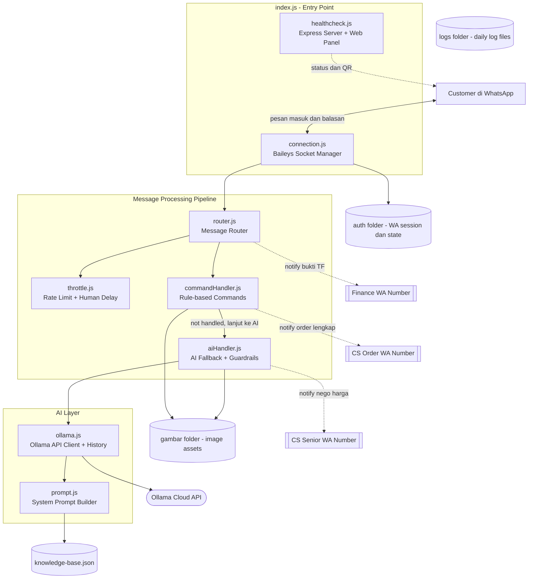
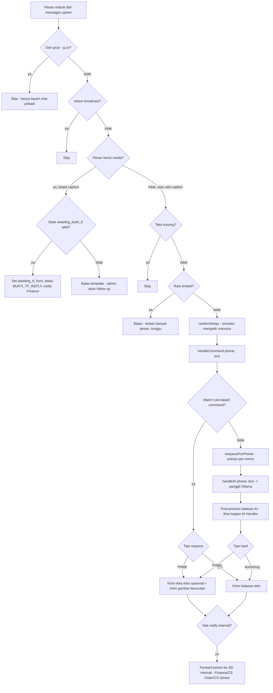
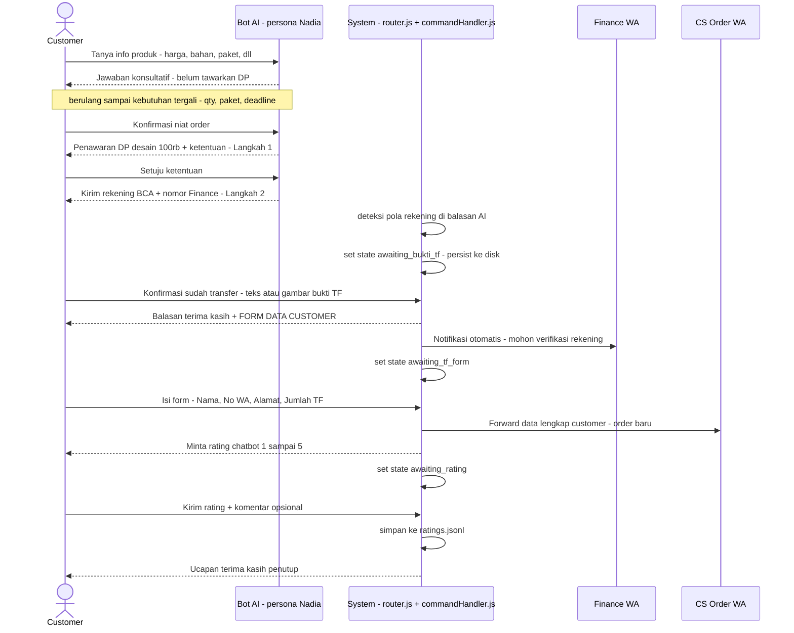
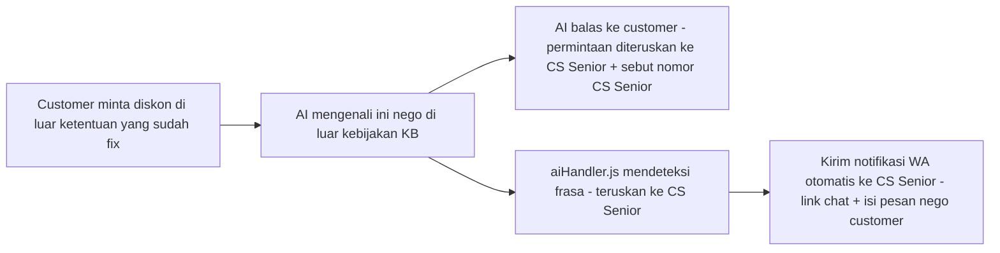
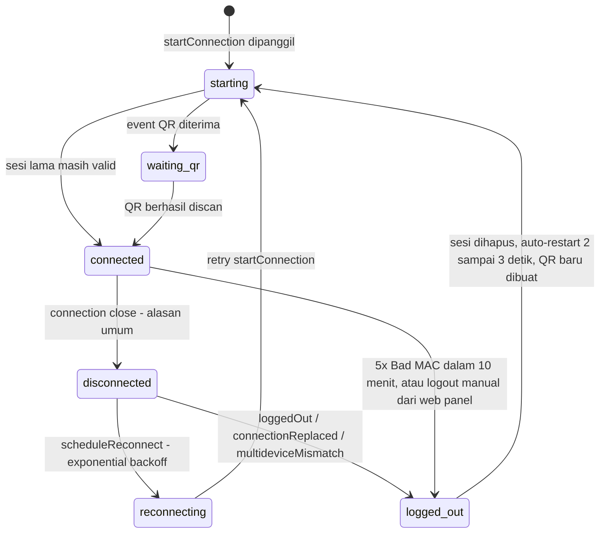

# WhatsApp Chatbot — Ayres Apparel

Bot WhatsApp customer service otomatis untuk **Ayres Apparel** (brand custom jersey olahraga), dibangun dengan `Baileys` (WhatsApp Web protocol) dan AI (`Ollama API` — persona bernama **Nadia**). Bot ini menggabungkan **rule-based command handler** (respons cepat & deterministik untuk perintah umum) dengan **AI fallback** (percakapan natural, konsultasi produk, dan alur closing order) yang di-guard oleh serangkaian aturan bisnis ketat di dalam system prompt.

Dokumen ini adalah dokumentasi teknis lengkap: arsitektur, seluruh alur pesan, state machine internal, siklus hidup koneksi WhatsApp, hingga panduan instalasi & deployment.

---

## Daftar Isi

1. [Ringkasan & Fitur Utama](#ringkasan--fitur-utama)
2. [Arsitektur Sistem](#arsitektur-sistem)
3. [Struktur Project](#struktur-project)
4. [Alur Pemrosesan Pesan Masuk](#alur-pemrosesan-pesan-masuk)
5. [Command Handler — Rule-Based Engine](#command-handler--rule-based-engine)
6. [AI Handler — Fallback ke Ollama](#ai-handler--fallback-ke-ollama)
7. [Alur Order & DP Desain (End-to-End)](#alur-order--dp-desain-end-to-end)
8. [Eskalasi Nego Harga](#eskalasi-nego-harga)
9. [Siklus Hidup Koneksi WhatsApp](#siklus-hidup-koneksi-whatsapp)
10. [Manajemen State](#manajemen-state)
11. [Modul & Tanggung Jawab](#modul--tanggung-jawab)
12. [Environment Variables](#environment-variables)
13. [Instalasi & Menjalankan Secara Lokal](#instalasi--menjalankan-secara-lokal)
14. [Health Check & Web Panel](#health-check--web-panel)
15. [Knowledge Base & Aset Gambar](#knowledge-base--aset-gambar)
16. [Deployment ke Railway](#deployment-ke-railway)
17. [Keamanan & Anti-Ban](#keamanan--anti-ban)
18. [Troubleshooting](#troubleshooting)
19. [Dokumen Terkait](#dokumen-terkait)

---

## Ringkasan & Fitur Utama

- **Koneksi WhatsApp** via `@whiskeysockets/baileys` (multi-device, QR login), dengan auto-reconnect, watchdog, dan pemulihan sesi otomatis saat error dekripsi (`Bad MAC`).
- **Rule-based command handler** — lebih dari 30 kategori keyword (katalog, size chart, pricelist, bahan, promo, reseller, dll) dijawab langsung tanpa memanggil AI, termasuk pengiriman gambar dari folder lokal.
- **AI fallback (Ollama)** — pesan yang tidak match rule diteruskan ke model AI berperan sebagai CS bernama **Nadia**, dengan system prompt panjang berisi kebijakan harga, alur DP desain, aturan nego, aturan promo, dan knowledge base produk.
- **Alur order end-to-end** — dari konsultasi produk → penawaran DP desain Rp100.000 → pengiriman rekening → konfirmasi bukti transfer → form data customer → notifikasi paralel ke Finance & CS Order → permintaan rating chatbot.
- **Eskalasi otomatis ke manusia** — nego harga di luar kebijakan diteruskan ke CS Senior; bukti transfer diteruskan ke Finance; order lengkap diteruskan ke CS Order — semua via notifikasi WhatsApp otomatis ke nomor internal.
- **Web panel monitoring** — halaman HTML sederhana (`/`) untuk melihat status koneksi, scan QR dari browser, dan tombol logout, di-poll setiap 3 detik.
- **Rate limiting & delay manusiawi** — mencegah pemblokiran akun WhatsApp akibat pola bot yang terlalu mekanis.
- **State per-customer persisten** — status "menunggu bukti TF", "menunggu form", "menunggu rating" disimpan ke disk (bukan hanya memori) sehingga tahan restart.

---

## Arsitektur Sistem



`index.js` adalah satu-satunya entry point: memuat `.env`, menjalankan health server terlebih dahulu (wajib untuk Railway yang butuh port ter-bind), lalu menjalankan watchdog koneksi dan koneksi Baileys. Semua modul lain di-import dari sana secara tidak langsung melalui `src/core`.

---

## Struktur Project

```
chatbot-wa/
├── index.js                          # Entry point — bootstrap semua service
├── knowledge-base.json               # Konten pengetahuan CS (harga, bahan, alur, dll)
├── data.md                           # Draft mentah data/skrip CS (sumber knowledge base)
├── requirement_dp_design.md          # Draft ketentuan alur DP desain
├── REVISI_CHATBOT_MEETING_2026-05-25.md
├── REVISI_CHATBOT_REPORT_2026-05-26.md
├── package.json / package-lock.json
├── railway.toml / Procfile           # Konfigurasi deploy Railway
├── .env / .env.example
├── Readme.md                         # Dokumen ini
├── README-DEPLOY.md                  # Panduan detail deploy Railway
├── auth/                             # (gitignored) sesi Baileys + state JSON per-customer
├── logs/                             # (gitignored) log harian (pino, rotasi otomatis)
├── gambar/                           # Aset gambar yang dikirim bot, dikelompokkan per topik
│   ├── Alur pemesanan/
│   ├── Bahan/
│   ├── express/                      # (lihat catatan audit di bawah)
│   ├── jenis kerah/
│   ├── katalog/
│   │   ├── katalog classic Adi Vira/
│   │   ├── katalog classic Cakra Vega/
│   │   ├── katalog pro Bima Sena/
│   │   └── katalog pro Garuda Vastra/
│   ├── Logo 3d/
│   ├── Pola/
│   ├── Pricelist Jaket/
│   ├── Pricelist Jersey/
│   │   ├── Nusantara/
│   │   ├── Paket Classic/
│   │   ├── Paket Pro/
│   │   ├── Paket Standar/
│   │   ├── Tambahan/
│   │   └── Warrior Combat/
│   ├── Pricelist Makloon/
│   ├── Promo/
│   ├── Reseller/
│   ├── Size Chart/
│   ├── Size Chart Boxy/
│   └── Warna/
└── src/
    ├── ai/
    │   ├── ollama.js                 # Klien Ollama API + riwayat percakapan
    │   └── prompt.js                 # Builder system prompt (persona Nadia + kebijakan bisnis)
    ├── core/
    │   ├── connection.js             # Koneksi Baileys, QR, reconnect, watchdog
    │   ├── healthcheck.js            # Express server, web panel, API status/QR/logout
    │   └── router.js                 # Router pesan masuk → command / AI
    ├── handlers/
    │   ├── commandHandler.js         # 30+ rule keyword, state machine order flow
    │   └── aiHandler.js              # Post-processing balasan AI + guardrail
    └── utils/
        ├── logger.js                 # Pino logger, file rotation harian, retensi
        └── throttle.js               # Rate limit + delay manusiawi
```

> **Catatan audit:** folder `gambar/express/` ada di disk tetapi **tidak direferensikan oleh kode manapun** — balasan express (`EXPRESS_REPLY` di `commandHandler.js`) murni teks tanpa gambar. Folder ini kemungkinan aset yang belum diintegrasikan; bisa dihapus atau dihubungkan ke handler bila memang perlu mengirim gambar pricelist express.

---

## Alur Pemrosesan Pesan Masuk

Setiap pesan masuk WhatsApp (event `messages.upsert` dari Baileys) diproses oleh `routeMessage()` di `src/core/router.js` melalui pipeline berikut:



Poin penting dalam pipeline ini:

- **Hanya chat pribadi** yang dilayani — pesan grup (`@g.us`) dan broadcast/status di-skip total.
- **Media tanpa caption** ditangani khusus: jika customer sedang berada dalam state *menunggu bukti TF*, gambar tersebut otomatis dianggap bukti transfer dan diteruskan ke Finance. Jika tidak, bot membalas template umum "admin akan follow up".
- **Rate limit** dicek sebelum command/AI diproses — mencegah spam dari satu nomor membanjiri AI atau memicu deteksi bot oleh WhatsApp.
- **`randomDelay()`** selalu dijalankan sebelum balasan pertama — mensimulasikan waktu mengetik manusia (default 800–2000ms, dapat dikonfigurasi).
- **Command handler dicek lebih dulu** — hanya jika tidak ada rule yang cocok (`handled: false`), pesan diteruskan ke AI.
- **Antrian per nomor (`enqueueForPhone`)** — mencegah dua pesan beruntun dari nomor yang sama diproses AI secara paralel (race condition pada riwayat percakapan).
- **Notifikasi internal** (`notify.jid` + `notify.message`) dapat dikembalikan baik oleh command handler maupun AI handler, dan selalu dikirim setelah balasan ke customer terkirim.

---

## Command Handler — Rule-Based Engine

`src/handlers/commandHandler.js` mengevaluasi pesan customer terhadap daftar rule **secara berurutan** (yang pertama match yang menang). Urutan ini penting karena beberapa rule saling tumpang tindih (mis. kata "pro" bisa match tier paket maupun kata lain).

| # | Kategori | Trigger (ringkas) | Perilaku |
|---|----------|--------------------|----------|
| 1 | `ping` | persis `ping` | balas `pong` |
| 2 | Konfirmasi bukti TF | state `awaiting_bukti_tf` aktif + frasa konfirmasi (`sudah transfer`, `udah tf`, `sip`, dst) | set `awaiting_tf_form`, kirim form data, notify Finance |
| 3 | Rating chatbot | state `awaiting_rating` aktif + angka 1–5 | simpan ke `ratings.jsonl`, balas terima kasih |
| 4 | Form data lengkap | state `awaiting_tf_form` aktif + 4 field terisi (Nama/No WA/Alamat/Jumlah TF) | set `awaiting_rating`, notify CS Order |
| 5 | Greeting/menu | `halo`, `hai`, `selamat pagi`, `assalamualaikum`, `menu`, dst (strict, harus murni sapaan) | balas sapaan acak (anti-template) |
| 6 | `reset` / `/reset` | — | hapus riwayat AI + semua state customer |
| 7 | `admin` | — | balas "dihubungkan ke admin" |
| 8 | Order intent | `mau pesan`, `mau order`, `lanjut aja`, dst | clear state katalog/pricelist, serahkan ke AI |
| 9 | Express | `express`, `urgent`, `1 hari`...`7 hari` | balas `EXPRESS_REPLY` (tarif & syarat lengkap) |
| 10 | Pricelist jersey (step 2) | state `awaiting_pricelist_jersey` + pilih angka/nama paket | kirim gambar pricelist paket terpilih |
| 11 | Katalog (step 2) | state `awaiting_katalog` + pilih angka/nama katalog | kirim gambar katalog terpilih |
| 12 | Pattern Lab | `pattern lab`, `pola jersey`, `tipe pola` | jelaskan 4 pola (Cakra Vega, Adi Vira, Garuda Vastra, Bima Sena), set state katalog untuk lanjutan |
| 13 | Contoh jersey per paket | `contoh paket standar/classic/pro` (toleran typo) | balas link Instagram sesuai tier |
| 14 | Katalog (step 1) | `katalog`, `catalog`, `model jersey` | tampilkan 4 pilihan / langsung kirim bila nama disebut |
| 15 | Katalog direct mention | nama katalog + kata `gambar/foto/lihat/kirim` tanpa state aktif | langsung kirim gambar |
| 16 | Size Chart Boxy | `size chart boxy`, `ukuran boxy` | kirim gambar size chart boxy |
| 17 | Size Chart reguler | `size chart`, `ukuran jersey`, dst | kirim gambar size chart |
| 18 | Alur Pemesanan | `cara pesan`, `alur order`, dst | ringkasan 7 langkah + gambar |
| 19 | Bahan | `jenis bahan`, `bahan kain`, dst | penjelasan 4 tier bahan + gambar |
| 20 | Jenis Kerah | `jenis kerah`, `model kerah` | kirim gambar pilihan kerah |
| 21 | Logo 3D | `logo 3d`, `logo timbul`, dst | ketentuan Tatami/Flock/Rubber + gambar |
| 22 | Pola/Pattern | `pola`, `motif jersey` | penjelasan katalog pola vs full custom + gambar |
| 23 | Pricelist Jersey (step 1) | `pricelist jersey`, `harga jersey`, dst | tampilkan 6 pilihan paket |
| 24 | Pricelist Jaket | `jaket`, `harga jaket` | kirim gambar pricelist jaket |
| 25 | Pricelist Makloon | `makloon`, `maklon` | kirim gambar pricelist makloon |
| 26 | Promo | `promo`, `diskon`, `penawaran` | kirim gambar promo aktif |
| 27 | COD | `cod`, `bayar di tempat` | tolak COD, arahkan transfer/QRIS |
| 28 | Reseller | `reseller`, `jadi reseller` | kirim gambar info program reseller |
| 29 | Referensi Warna | `referensi warna`, `warna tersedia` | kirim gambar referensi warna |
| 30 | Contoh desain (generik) | `contoh desain`, `hasil desain` | arahkan ke link IG (tanpa kirim gambar lokal) |
| 31 | Tanya soal foto terkirim | `di foto ini`, `ini bahan apa`, dst | balas "akan ditanyakan ke admin" |
| 32 | Referensi desain ("mau kayak ini") | `seperti ini bisa`, `mau kayak ini` | balas "referensi diterima, admin follow up" |
| 33 | Fallback minta gambar tak dikenal | `kirim gambar`, `minta foto` (tidak match kategori manapun) | balas template admin follow up |
| 34 | Blacklist | `judi`, `togel`, `porn`, `scam`, dst | tolak bantu |
| 35 | *(tidak ada match)* | — | `{ handled: false }` → diteruskan ke AI |

Beberapa detail penting:

- **State katalog & pricelist** (langkah 10/11/23) adalah *2-step flow*: pesan pertama menampilkan daftar pilihan, pesan kedua (angka atau nama) mengirim gambar aktualnya. Jika di step kedua customer justru mengirim detail order (terdeteksi lewat `isOrderContextGlobal`), state dibatalkan dan pesan diteruskan ke AI — mencegah bot "nyangkut" menunggu pilihan katalog padahal customer sudah lanjut ke pembicaraan order.
- **Deteksi tier "contoh paket"** (langkah 13) toleran terhadap typo umum bahasa Indonesia (`stadar`, `klasik`, `kelasik`, dll) menggunakan regex word-boundary supaya `pro` tidak salah match kata lain yang mengandung "pro" (mis. "produksi").
- **Greeting** menggunakan regex *strict end-of-string* — sengaja diperbaiki dari implementasi lama yang pakai `includes()` sehingga pesan seperti *"hai kak saya mau pesan jersey futsal 9 pcs"* tidak lagi salah ke-intercept sebagai sekadar sapaan.

---

## AI Handler — Fallback ke Ollama

Ketika `commandHandler` mengembalikan `{ handled: false }`, `src/handlers/aiHandler.js` mengambil alih:

1. **Bangun konteks** — `askAI()` di `src/ai/ollama.js` menyusun array pesan: `system prompt` (dari `buildSystemPrompt()`) + riwayat percakapan (`MAX_HISTORY` pesan terakhir, default 40) + pesan baru customer.
2. **Panggil Ollama** — `POST {OLLAMA_HOST}/api/chat` dengan model `OLLAMA_MODEL` (default `gpt-oss:120b-cloud`), dibatasi oleh **semaphore** (`MAX_CONCURRENT_AI`, default 5 request paralel) dan **retry** otomatis (`AI_MAX_RETRIES`, default 2x, hanya untuk error 5xx/429) dengan backoff linear.
3. **Timeout** (`AI_TIMEOUT`, default 25 detik) menghasilkan fallback pesan "sistem sedang sibuk" alih-alih error mentah ke customer.
4. **Post-processing balasan AI** (di `aiHandler.js`), berjalan setiap kali AI membalas:
   - **Deteksi rekening DP** (`REKENING_PATTERN` — nomor rekening atau nama CV) → set state `awaiting_bukti_tf` untuk nomor tersebut.
   - **Deteksi eskalasi nego** (`NEGO_ESCALATION_PATTERN` — frasa "teruskan ke CS Senior") → siapkan notifikasi ke CS Senior berisi link chat customer & isi pesan nego.
   - **Deteksi niat kirim gambar** (`IMAGE_TRIGGERS`) — jika AI menulis frasa seperti "berikut promo..." atau "berikut size chart...", sistem otomatis mengganti balasan tersebut dengan pengiriman gambar asli dari folder terkait (bukan hanya teks kosong berjanji kirim gambar).
   - **Guardrail `normalizeReply()`** — mencegah AI "berjanji" mengirim gambar padahal tidak bisa (menggantinya dengan template follow-up admin), dan menyisipkan catatan kapasitas produksi otomatis jika AI membahas express tapi lupa menyebutkan disclaimer load produksi.
5. Riwayat percakapan (`historyMap`) **hanya tersimpan di memori proses** — akan hilang saat bot restart (berbeda dengan state bukti TF/form/rating yang persisten ke disk).

System prompt (`src/ai/prompt.js`) memberi persona **Nadia** dan berisi kebijakan bisnis sangat rinci, di antaranya:

- **Larangan tanya ulang** — sebelum bertanya, AI wajib cek riwayat chat dulu; info yang sudah pernah disebutkan customer (qty, jenis olahraga, deadline, status desain, kota tujuan, dll) tidak boleh ditanya ulang. Ditambahkan untuk mengatasi bug AI kehilangan konteks pada percakapan panjang (lihat catatan `MAX_HISTORY` di bawah).
- Wajib mengakhiri **setiap** balasan dengan satu pertanyaan konsultatif kontekstual (tidak boleh generik/berulang).
- Aturan **qty gate promo** — promo bawaan (FREE 3D Logo, FREE Bola, dll) hanya berlaku ≥12 pcs; di bawah itu AI wajib jujur & menawarkan upgrade qty, dilarang keras memicu frasa yang otomatis mengirim gambar promo.
- Aturan **ongkir** — selalu sertakan estimasi ongkir JNE JTR per provinsi + disclaimer wajib bahwa tarif final ditentukan CS Order.
- Aturan **urgency & closing** — urgency/dorongan closing baru boleh muncul setelah minimal 3 turn percakapan atau customer menyebut deadline, tidak boleh di 1–2 balasan pertama.
- **Alur DP Desain 3 langkah** (dijelaskan detail di bagian berikutnya) dengan larangan tegas menyebut nomor rekening/finance di luar konteks yang tepat.

---

## Alur Order & DP Desain (End-to-End)

Ini adalah alur bisnis inti bot — dari konsultasi produk hingga serah terima ke tim manusia (Finance & CS Order):



Detail tiap tahap:

1. **Konsultasi bebas** — AI menjawab pertanyaan produk sebagai konsultan, *tanpa* mendorong DP di awal.
2. **Langkah 1 — Penawaran DP** dimunculkan AI hanya setelah customer menunjukkan niat serius (pilih paket + qty + arah desain, atau eksplisit minta DP).
3. **Langkah 2 — Kirim rekening** hanya setelah customer menyatakan setuju ketentuan. Begini caranya router "tahu" rekening sudah dikirim: `aiHandler.js` mem-parsing **setiap** balasan AI dengan regex nomor rekening/nama CV — begitu cocok, nomor customer otomatis ditandai `awaiting_bukti_tf` (disimpan ke `auth/bukti_tf_state.json`, kedaluwarsa 24 jam).
4. **Konfirmasi transfer** — dapat berupa teks (`"sudah transfer"`, `"sip"`, dll — dicek oleh `isBuktiTfConfirmation()`) atau **gambar tanpa caption** (ditangkap langsung di `router.js` sebelum masuk command handler biasa). Kedua jalur menghasilkan hasil yang sama: balas form data ke customer + notifikasi paralel ke Finance.
5. **Form data** — divalidasi ketat (`isPostTfFormFilled()`) harus mengandung 4 label: Nama, No WA, Alamat, Jumlah TF. Begitu lengkap, sistem forward ke CS Order dengan catatan eksplisit *"Finance masih verifikasi — mohon tunggu green light"* sebelum CS Order lanjut proses.
6. **Rating** — permintaan rating 1–5 dikirim di akhir alur; jawaban dicatat ke `auth/ratings.jsonl` untuk evaluasi kualitas chatbot dari waktu ke waktu.

Seluruh notifikasi ke Finance/CS Order **berjalan paralel**, bukan berurutan — Finance sudah bisa mulai verifikasi rekening sejak customer konfirmasi TF, tanpa menunggu customer selesai mengisi form.

---

## Eskalasi Nego Harga



System prompt membedakan tegas dua kondisi yang sering tertukar:

- **Nego harga** (customer minta *penurunan* harga/ongkir/biaya yang sudah fix di KB) → wajib eskalasi ke CS Senior memakai frasa pemicu persis `teruskan ke CS Senior` (dideteksi oleh `NEGO_ESCALATION_PATTERN` di `aiHandler.js`) plus menyebut nomor CS Senior ke customer.
- **Promo yang tidak ada di KB** (mis. "ada promo cashback?") → **tidak** eskalasi, cukup ditolak sopan + diarahkan ke promo bawaan yang memang aktif.

---

## Siklus Hidup Koneksi WhatsApp

`src/core/connection.js` mengelola seluruh siklus hidup socket Baileys, termasuk resiliensi terhadap disconnect, sesi korup, dan startup yang macet.



Mekanisme resiliensi tambahan (di luar transisi state di atas):

- **Exponential backoff** — delay reconnect naik bertahap (`5s × attempt`, dibatasi maksimum `60s`).
- **Bad MAC tracking** — error dekripsi Signal Protocol (`Bad MAC`) dihitung dalam jendela waktu 10 menit; jika ≥5 kali, sesi dianggap korup dan **dihapus otomatis** lalu diminta QR baru — mencegah bot terjebak loop error dekripsi permanen.
- **Connection watchdog** (`startConnectionWatchdog`, interval default 60 detik) — memaksa reconnect kalau bot macet di state `disconnected`/`reconnecting` >3 menit, macet di `starting` >2 menit, atau socket `connected` tapi WebSocket sebenarnya tidak sehat (>2 menit tanpa aktivitas & `readyState !== OPEN`). Ini mengamankan dari kondisi "zombie" yang sulit dideteksi hanya dari event `connection.update`.
- **Credential save queue** — `saveCreds()` di-serialize lewat promise queue (`credsSaveQueue`) supaya penulisan file sesi tidak saling tabrakan saat event `creds.update` datang beruntun.
- **Session dir otomatis** — `SESSION_DIR` di-resolve otomatis ke `/data/auth` bila terdeteksi environment Railway/volume `/data`, atau `./auth` secara lokal.

---

## Manajemen State

Selain riwayat percakapan AI, bot menyimpan beberapa state per-nomor customer. Sebagian hanya di memori (hilang saat restart), sebagian dipersist ke disk (`auth/` atau `SESSION_DIR`) supaya tahan restart:

| State | Lokasi kode | Persisten? | File disk | Kedaluwarsa | Fungsi |
|---|---|---|---|---|---|
| `katalogState` | `commandHandler.js` | ❌ memori saja | — | — | Tandai customer sedang di step 2 pemilihan katalog |
| `pricelistJerseyState` | `commandHandler.js` | ❌ memori saja | — | — | Tandai customer sedang di step 2 pemilihan pricelist |
| `awaitingBuktiTfState` | `commandHandler.js` | ✅ | `bukti_tf_state.json` | 24 jam | Tandai customer sudah dikirimi rekening, menunggu bukti TF |
| `awaitingTfFormState` | `commandHandler.js` | ✅ | `tf_form_state.json` | 24 jam | Tandai customer sudah konfirmasi TF, menunggu form data |
| `awaitingRatingState` | `commandHandler.js` | ✅ | `rating_state.json` | 24 jam | Tandai customer diminta memberi rating chatbot |
| Log rating | `commandHandler.js` | ✅ (append-only) | `ratings.jsonl` | — | Riwayat rating & komentar customer |
| `historyMap` (riwayat chat AI) | `ollama.js` | ❌ memori saja | — | maks `MAX_HISTORY` pesan | Konteks percakapan yang dikirim ke Ollama |
| `phoneQueues` | `router.js` | ❌ memori saja | — | — | Antrian serial per nomor agar AI tidak diproses paralel untuk customer yang sama |
| Semaphore AI | `ollama.js` | ❌ memori saja | — | — | Batasi jumlah request Ollama paralel (global, `MAX_CONCURRENT_AI`) |

> Semua file state disk disimpan di folder yang sama dengan sesi WhatsApp (`SESSION_DIR`, default `./auth` lokal / `/data/auth` di Railway) — sehingga pada volume persistent Railway, state ini juga aman dari restart/redeploy.

`reset` / `/reset` hanya membersihkan riwayat AI + `katalogState` + `pricelistJerseyState` + `awaitingBuktiTfState` untuk nomor tersebut — **tidak** membersihkan `awaitingTfFormState` maupun `awaitingRatingState` (by design, karena alur itu sudah melibatkan tim manusia).

---

## Modul & Tanggung Jawab

| File | Tanggung Jawab Utama | Ekspor Penting |
|---|---|---|
| `index.js` | Bootstrap aplikasi, urutan startup, graceful shutdown, penanganan uncaught error | — |
| `src/core/connection.js` | Socket Baileys, QR, reconnect, watchdog, resolusi `SESSION_DIR` | `startConnection`, `logoutBot`, `requestReconnect`, `startConnectionWatchdog`, `getConnectionSnapshot` |
| `src/core/router.js` | Filter pesan, orkestrasi command vs AI, pengiriman teks/gambar, antrian per nomor | `routeMessage` |
| `src/core/healthcheck.js` | Server Express, web panel HTML, endpoint status/QR/logout | `startHealthServer`, `setStatus`, `setQR` |
| `src/handlers/commandHandler.js` | 30+ rule keyword, state machine order flow, blacklist | `handleCommand`, helper state (`isAwaitingBuktiTf`, dll), konstanta JID internal |
| `src/handlers/aiHandler.js` | Post-processing balasan AI: deteksi rekening, nego, gambar, guardrail | `handleAI` |
| `src/ai/ollama.js` | Klien HTTP ke Ollama, retry, semaphore, riwayat percakapan | `askAI`, `clearHistory` |
| `src/ai/prompt.js` | Bangun system prompt (persona + kebijakan bisnis + knowledge base) | `buildSystemPrompt`, `loadKnowledgeBase` |
| `src/utils/logger.js` | Pino logger dual-stream (console + file harian), retensi log, masking nomor telepon | `logger`, `maskPhone`, `LOG_DIR` |
| `src/utils/throttle.js` | Rate limit per nomor, delay acak human-like | `isRateLimited`, `randomDelay` |

---

## Environment Variables

Variabel yang **sudah ada** di `.env.example`:

| Variabel | Default | Keterangan |
|---|---|---|
| `OLLAMA_HOST` | `https://ollama.com` | Base URL Ollama API |
| `OLLAMA_KEY` | *(kosong)* | API key Ollama (dikirim sebagai Bearer token) |
| `OLLAMA_MODEL` | `gpt-oss:120b-cloud` | Nama model yang dipanggil |
| `AI_TIMEOUT` | `25000` (ms) | Timeout request ke Ollama sebelum fallback "sistem sibuk" |
| `MAX_HISTORY` | `40` | Jumlah pesan riwayat percakapan yang dikirim sebagai konteks (dinaikkan dari 10 → 40 karena alur konsultasi order sering >5 tukar pesan; window terlalu kecil menyebabkan AI "lupa" info yang sudah dijawab customer dan tanya ulang) |
| `RATE_LIMIT_MAX` | `10` | Maksimum pesan per window per nomor |
| `RATE_LIMIT_WINDOW` | `60000` (ms) | Ukuran window rate limit |
| `REPLY_DELAY_MIN` / `REPLY_DELAY_MAX` | `800` / `2000` (ms) | Rentang delay acak sebelum bot membalas |
| `LOG_LEVEL` | `info` | Level log pino |
| `SESSION_DIR` | `./auth` (lokal) / `/data/auth` (Railway) | Lokasi penyimpanan sesi Baileys + file state |
| `LOG_DIR` | `./logs` (lokal) / `/data/logs` (Railway) | Lokasi file log harian |
| `WA_WATCHDOG_INTERVAL_MS` | `60000` | Interval pengecekan watchdog koneksi |
| `WA_WATCHDOG_DISCONNECTED_MS` | `180000` | Ambang batas macet di `disconnected`/`reconnecting` sebelum dipaksa reconnect |
| `WA_WATCHDOG_STARTING_MS` | `120000` | Ambang batas macet di `starting` |
| `WA_WATCHDOG_CONNECTED_STALE_MS` | `120000` | Ambang batas socket `connected` tapi tidak sehat |

Variabel **tambahan** yang dikenali kode tetapi belum ada di `.env.example` (punya default hardcoded, opsional untuk di-override):

| Variabel | Default (di kode) | Keterangan |
|---|---|---|
| `PORT` | `3000` | Port HTTP health server (di Railway di-inject otomatis) |
| `MAX_CONCURRENT_AI` | `5` | Jumlah request Ollama paralel maksimum (semaphore) |
| `AI_MAX_RETRIES` | `2` | Jumlah retry otomatis saat Ollama error 5xx/429 |
| `LOG_RETENTION_DAYS` | `14` | Berapa hari file log harian disimpan sebelum dihapus otomatis |
| `PROMO_TAGLINE` | *(kosong)* | Teks promo yang diselipkan AI & greeting bila ada promo aktif |
| `FINANCE_JID` | `6288225968185` | Nomor WA Finance (tanpa `+`/`@s.whatsapp.net`) tujuan notifikasi bukti TF |
| `CS_ORDER_JID` | `6287898555117` | Nomor WA CS Order tujuan forward data order lengkap |
| `CS_ORDER_NUMBER_DISPLAY` | `+62 878-9855-5117` | Format nomor CS Order yang ditampilkan ke customer |
| `CS_SENIOR_JID` | `6287898555117` | Nomor WA CS Senior tujuan eskalasi nego harga |
| `RAILWAY_ENVIRONMENT` | — | Terdeteksi otomatis oleh Railway; memicu default `SESSION_DIR`/`LOG_DIR` ke `/data/...` |

---

## Instalasi & Menjalankan Secara Lokal

### 1. Persiapan

- Node.js `>= 18`
- npm
- Akun WhatsApp khusus untuk bot (disarankan bukan nomor pribadi utama)
- API key Ollama

### 2. Install dependency

```bash
npm install
```

### 3. Setup environment

```bash
cp .env.example .env
```

Isi minimal `OLLAMA_KEY` di `.env`. Untuk nomor internal (Finance/CS Order/CS Senior) dan `PROMO_TAGLINE`, tambahkan manual sesuai tabel [Environment Variables](#environment-variables) di atas bila ingin override dari default.

### 4. Siapkan folder gambar

Taruh gambar (`.jpg`, `.jpeg`, `.png`, `.webp`) di folder `gambar/...` sesuai [Struktur Project](#struktur-project). Gambar pertama di setiap folder otomatis diberi caption; gambar lainnya dikirim polos (lihat `getImagesFromFolder()` / `getKatalogImages()` / `getPricelistJerseyImages()`).

### 5. Jalankan bot

```bash
npm start
```

Mode development (auto-restart saat file di `src/`, `index.js`, atau `knowledge-base.json` berubah):

```bash
npm run dev
```

### 6. Scan QR WhatsApp

Saat pertama kali jalan, QR muncul di terminal **dan** di web panel (`http://localhost:3000`). Buka WhatsApp di HP → **Perangkat tertaut → Tautkan perangkat** → scan salah satu QR. Status `connected` menandakan sukses.

---

## Health Check & Web Panel

| Endpoint | Metode | Kegunaan |
|---|---|---|
| `/` | GET | Web panel HTML — status koneksi real-time (poll 3 detik), tampilkan QR untuk scan langsung dari browser, tombol logout |
| `/api/status` | GET | JSON status: `status`, `connectedAt`, `uptimeSeconds`, `reconnectAttempts`, `lastDisconnectReason`, `hasQR` |
| `/api/qr` | GET | QR code sebagai PNG (404 bila tidak ada QR aktif) |
| `/api/logout` | POST | Trigger logout bot (hapus sesi, minta QR baru) — dipakai tombol di web panel |
| `/health` | GET | `200` jika `status === "connected"`, selain itu `503` — dipakai Railway healthcheck |

Health server **selalu dijalankan pertama** sebelum koneksi WhatsApp dimulai (`index.js`), karena Railway mensyaratkan port ter-bind lebih dulu agar deployment tidak dianggap gagal, meski bot masih di state `waiting_qr`.

---

## Knowledge Base & Aset Gambar

- `knowledge-base.json` berisi field `content` (string panjang, ~29KB) yang disisipkan mentah ke system prompt AI (lihat `=== KNOWLEDGE BASE ===` di `prompt.js`). File ini adalah sumber kebenaran untuk harga, bahan, dan info produk yang **boleh** dijawab AI — AI diinstruksikan tegas untuk tidak mengarang info di luar file ini.
- `data.md` dan `requirement_dp_design.md` adalah draft/sumber mentah yang dipakai menyusun `knowledge-base.json` dan bagian "ALUR DP DESAIN" di `prompt.js` — berguna sebagai referensi historis, tapi **bukan** yang dibaca langsung oleh bot saat runtime.
- Update konten: edit `knowledge-base.json` langsung (field `content`), lalu restart bot (dibaca sekali saat startup oleh `loadKnowledgeBase()`).
- Update gambar: cukup taruh/hapus file di folder `gambar/...` yang sesuai — dibaca ulang dari disk setiap kali handler dipanggil (tidak perlu restart).

---

## Deployment ke Railway

Ringkasan (detail lengkap ada di [`README-DEPLOY.md`](./README-DEPLOY.md)):

1. Buat project Railway dari repo GitHub ini — Railway otomatis mendeteksi Node.js dan menjalankan `node index.js` (via `Procfile` / `railway.toml`, builder `NIXPACKS`).
2. **Wajib** tambahkan persistent volume mount di `/data` — tanpa ini, sesi WhatsApp & state customer hilang setiap redeploy/restart instance, memaksa scan QR ulang.
3. Set environment variables (lihat tabel di atas) — minimal `OLLAMA_KEY`. `SESSION_DIR`/`LOG_DIR` otomatis fallback ke `/data/auth` dan `/data/logs` begitu volume terpasang.
4. Healthcheck Railway dikonfigurasi ke path `/` (`railway.toml`) — tetap `200` walau bot masih `waiting_qr`, supaya deployment tidak dianggap gagal saat menunggu scan QR pertama kali.
5. Setelah deploy, buka URL service → scan QR dari web panel → pantau `/api/status` sampai `connected`.

---

## Keamanan & Anti-Ban

- **Rate limiting per nomor** (`RATE_LIMIT_MAX` pesan / `RATE_LIMIT_WINDOW`) mencegah satu customer membanjiri bot dan mengurangi pola respons yang terlalu mekanis.
- **Delay acak human-like** sebelum tiap balasan, plus delay 800ms antar gambar saat mengirim banyak gambar sekaligus.
- **`markOnlineOnConnect: false`** dan `syncFullHistory: false` pada konfigurasi socket Baileys — mengurangi jejak aktivitas yang tidak perlu.
- **Folder `auth/`** berisi kredensial sesi WhatsApp (setara token login) dan **wajib** tetap di `.gitignore` — jangan pernah commit folder ini atau isinya ke repository manapun.
- **Nomor internal** (Finance/CS Order/CS Senior) hanya boleh disebut AI pada konteks yang sangat spesifik (diatur ketat di `prompt.js`) — mencegah AI membocorkan kontak internal secara sembarangan ke customer.
- **Masking nomor telepon di log** (`maskPhone()`) — nomor customer di log hanya menampilkan 4 digit awal & akhir.

---

## Troubleshooting

**QR tidak muncul:**
- Pastikan proses tidak crash saat startup — cek log.
- Hapus folder sesi `auth/` (atau `/data/auth` di Railway) lalu jalankan ulang.

**Status `logged_out`:**
- Sesi terputus (logout dari HP, replaced device, atau terlalu banyak error `Bad MAC`). Bot otomatis menghapus sesi lama & generate QR baru — scan ulang.

**Bot tidak mengirim gambar:**
- Pastikan folder `gambar/...` yang relevan ada dan berisi file `.jpg/.jpeg/.png/.webp`.
- Cek log error `Image file not found` / `Failed to send image` untuk path yang bermasalah.

**Bot balas error AI / "sistem sedang sibuk":**
- Cek `OLLAMA_HOST`, `OLLAMA_KEY`, dan konektivitas internet keluar.
- Pastikan model di `OLLAMA_MODEL` tersedia di endpoint tersebut.
- Jika sering timeout, pertimbangkan menaikkan `AI_TIMEOUT`.

**Bot sering disconnect/reconnect terus-menerus:**
- Pastikan tidak ada instance lain login dengan nomor WA yang sama di device lain.
- Cek log untuk pola `Bad MAC` berulang — jika mencapai 5x dalam 10 menit, sesi otomatis di-reset (ini expected, bukan bug).
- Di Railway, pastikan volume `/data` benar-benar ter-mount (bukan ephemeral storage).

**Port bentrok (lokal):**
- Set `PORT` di `.env` sebelum menjalankan bot.

**Rate limit terlalu ketat / terlalu longgar:**
- Sesuaikan `RATE_LIMIT_MAX` dan `RATE_LIMIT_WINDOW` di `.env`.

**State customer (bukti TF/form/rating) tidak reset setelah `reset`:**
- Ini **by design** — `reset` hanya membersihkan riwayat chat AI, state katalog, dan state bukti TF. State form/rating sengaja dipertahankan karena sudah melibatkan proses manusia (Finance/CS Order) di baliknya.

---

## Dokumen Terkait

- [`README-DEPLOY.md`](./README-DEPLOY.md) — panduan detail deploy Railway (volume, env, verifikasi).
- [`knowledge-base.json`](./knowledge-base.json) — konten pengetahuan CS yang dipakai AI.
- [`data.md`](./data.md) — draft mentah data/skrip CS (sumber knowledge base).
- [`requirement_dp_design.md`](./requirement_dp_design.md) — draft ketentuan alur DP desain.
- [`REVISI_CHATBOT_MEETING_2026-05-25.md`](./REVISI_CHATBOT_MEETING_2026-05-25.md) / [`REVISI_CHATBOT_REPORT_2026-05-26.md`](./REVISI_CHATBOT_REPORT_2026-05-26.md) — riwayat rapat & laporan revisi chatbot.
